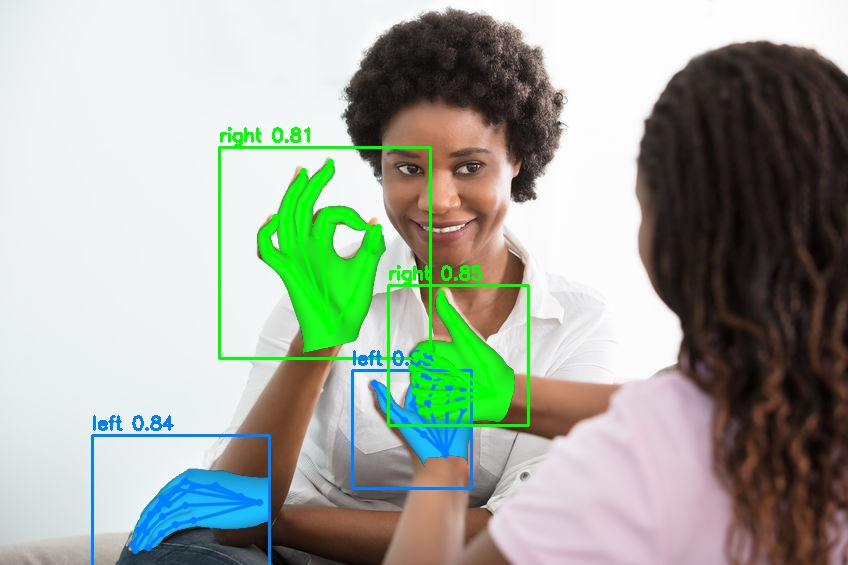
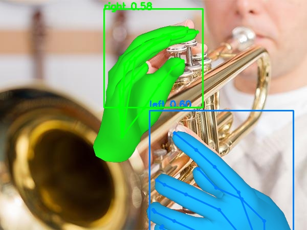
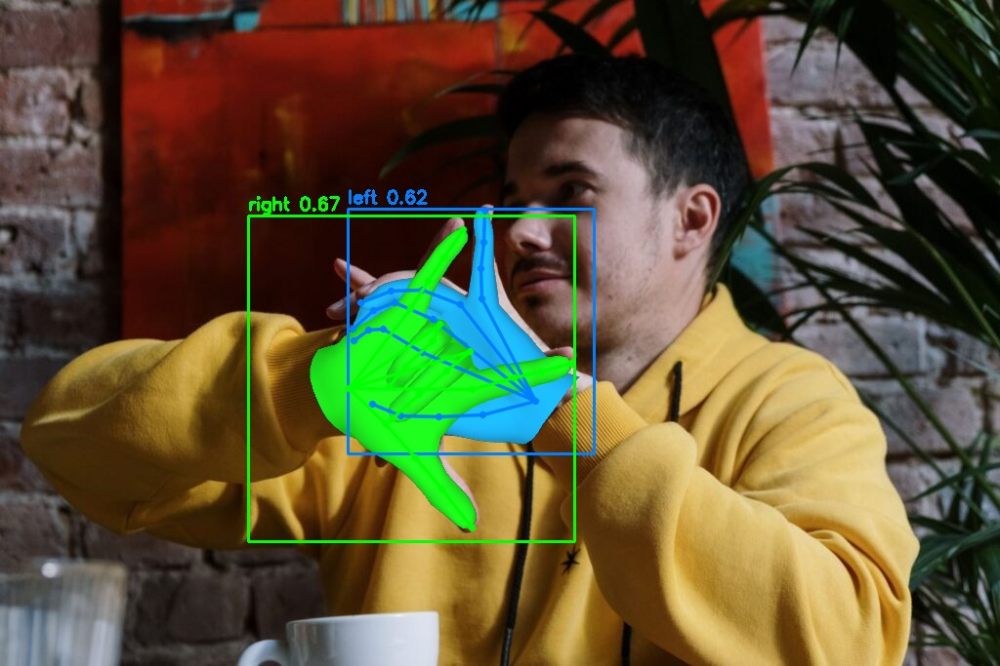
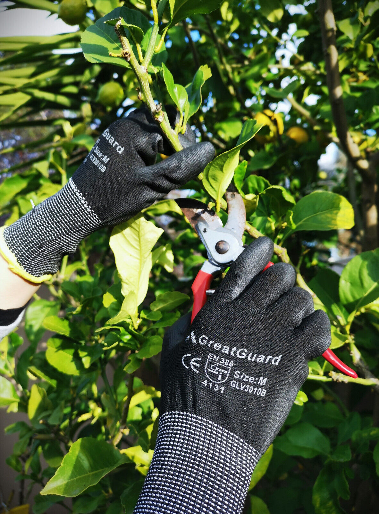
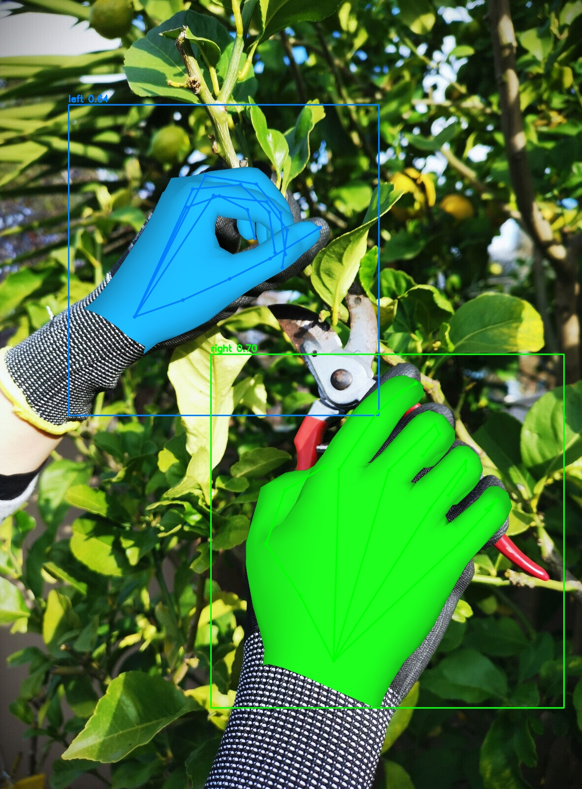

# hamer-mini

A minimal, pip-installable inference library for [HaMeR](https://github.com/geopavlakos/hamer) (Reconstructing Hands in 3D with Transformers, CVPR 2024).

<table>
  <tr>
    <td></td>
    <td></td>
    <td></td>
    <td></td>
  </tr>
  <tr>
    <td></td>
    <td></td>
    <td></td>
    <td></td>
  </tr>
</table>


## Installation

Requires Python 3.10. Install with [uv](https://docs.astral.sh/uv/) (PyTorch is resolved from the CUDA 11.8 index configured in `pyproject.toml`):

```bash
git clone https://github.com/ryhara/hamer-mini
cd hamer-mini
uv sync
# Optional: pyrender-based mesh visualization (falls back to OpenCV without it)
uv sync --extra render
```

### MANO hand model (required, manual download)

hamer-mini does not redistribute the MANO hand model. Before first use:

1. Register at [mano.is.tue.mpg.de](https://mano.is.tue.mpg.de) and accept the [MANO license](https://mano.is.tue.mpg.de/license.html)
2. Download **Models & Code** (`mano_v1_2.zip`)
3. Copy `mano_v1_2/models/MANO_RIGHT.pkl` to `~/.cache/hamer_mini/mano/MANO_RIGHT.pkl`

```bash
mkdir -p ~/.cache/hamer_mini/mano
cp mano_v1_2/models/MANO_RIGHT.pkl ~/.cache/hamer_mini/mano/
```

Alternatively, pass its location directly: `HaMeRHandPose3dEstimationPipeline(mano_model_path="/path/to/MANO_RIGHT.pkl")`.

## Usage

```python
import cv2
import torch
from hamer_mini import HaMeRHandPose3dEstimationPipeline

device = torch.device("cuda") if torch.cuda.is_available() else torch.device("cpu")
dtype = torch.float16 if device.type == "cuda" else torch.float32

pipe = HaMeRHandPose3dEstimationPipeline(device=device, dtype=dtype)

image = cv2.imread("example_data/test1.jpg")
image = cv2.cvtColor(image, cv2.COLOR_BGR2RGB)  # the pipeline expects RGB

outputs = pipe.predict(
    image,
    body_conf=0.5,            # person detection score threshold
    hand_conf=0.5,            # hand keypoint confidence threshold
    rescale_factor=2.0,       # padding factor around the detected hand box
    return_vertices_2d=True,  # optionally project the mesh vertices to the image
)
```

`predict()` returns one dict per detected hand:

| Key | Shape / type | Description |
| --- | --- | --- |
| `hand_bbox` | `list[4]` | Detection bounding box `[x1, y1, x2, y2]` in pixels |
| `hand_score` | `float` | Mean confidence of the confident hand keypoints, in `[0, 1]` |
| `is_right` | `float` | Handedness: `1.0` right, `0.0` left |
| `hamer_preds.global_orient` | `(1, 1, 3)` | Global hand orientation (axis-angle) |
| `hamer_preds.hand_pose` | `(1, 15, 3)` | MANO hand pose (axis-angle) |
| `hamer_preds.betas` | `(1, 10)` | MANO shape parameters |
| `hamer_preds.pred_cam` | `(1, 3)` | Weak-perspective camera in the crop frame |
| `hamer_preds.pred_cam_t_full` | `(1, 3)` | Camera translation in the full image frame |
| `hamer_preds.scaled_focal_length` | `float` | Focal length scaled to the full image |
| `hamer_preds.pred_keypoints_3d` | `(1, 21, 3)` | 3D hand joints (OpenPose ordering) |
| `hamer_preds.pred_vertices` | `(1, 778, 3)` | 3D MANO mesh vertices |
| `hamer_preds.pred_keypoints_2d` | `(1, 21, 2)` | 2D joints in full-image pixels |
| `hamer_preds.pred_vertices_2d` | `(1, 778, 2)` | 2D mesh vertices in full-image pixels (only with `return_vertices_2d=True`) |

To render or export the mesh, the MANO triangle faces are available as `pipe.mano_faces` (use `faces[:, [0, 2, 1]]` for left hands to fix the winding order).

If you already have hand bounding boxes, skip the detector:

```python
outputs = pipe.predict_with_bboxes(image, bboxes, is_rights)  # bboxes: (N, 4), is_rights: (N,)
```

### Demo

```bash
python demo.py --image example_data/test1.jpg --mesh --hand-conf 0.3
```

The demo draws the detection bbox, the 2D hand skeleton and (with `--mesh`) the MANO mesh, all in the same per-hand color (green = right, blue = left). With the `render` extra installed the mesh is rendered with pyrender (lighting and correct occlusion, headless via EGL); otherwise a built-in OpenCV rasterizer is used, so `--mesh` works without any OpenGL setup.

### Pipeline options

| Constructor kwarg | Default | Description |
| --- | --- | --- |
| `device` | CPU | `torch.device` to run on |
| `dtype` | `torch.float32` | HaMeR model dtype (`torch.float16` recommended on GPU) |
| `verbose` | `False` | Log progress messages |
| `body_detector` | `'vitdet'` | Person detector: `'vitdet'` (accurate) or `'regnety'` (lighter) |
| `body_conf` | `0.5` | Default person detection score threshold |
| `hand_conf` | `0.5` | Default hand keypoint confidence threshold |
| `focal_length` | `5000` | HaMeR training focal length (crop pixels) |
| `pretrained_dir` | `~/.cache/hamer_mini` | Weight cache directory (or `HAMER_MINI_PRETRAINED_DIR` env var) |
| `mano_model_path` | `<pretrained_dir>/mano/MANO_RIGHT.pkl` | Path to the manually downloaded MANO model |

## Weights

Downloaded automatically on first use:

- HaMeR checkpoint (`hamer.ckpt`), ViTPose wholebody checkpoint (`wholebody.pth`) and MANO mean parameters (`mano_mean_params.npz`) from the official [HaMeR Hugging Face Space](https://huggingface.co/spaces/geopavlakos/HaMeR)
- ViTDet person detector checkpoint from the [detectron2 model zoo](https://github.com/facebookresearch/detectron2/tree/main/projects/ViTDet)

Manual download required:

- `MANO_RIGHT.pkl` from [mano.is.tue.mpg.de](https://mano.is.tue.mpg.de) (see Installation)

## License

- Code: same license as [HaMeR](https://github.com/geopavlakos/hamer/blob/main/LICENSE.md). See [LICENSE](LICENSE).
- MANO: [MANO license](https://mano.is.tue.mpg.de/license.html)
